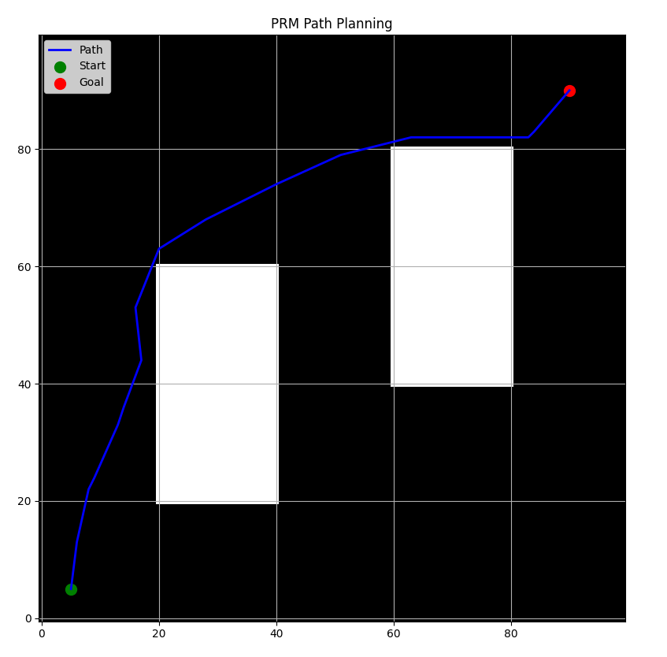

# Probabilistic Roadmap (PRM) Path Planning




**Authors:**  
- Tumelo Mkwambe - 2446873  
- Salmaan Ebrahim - 1696622  
- Amaan Hanslod - 2541305  

---

## 📌 Overview

This project implements a **Probabilistic Roadmap (PRM)** path planner in a 2D grid environment with rectangular obstacles. The planner takes as input:
- A start and goal position
- A set of rectangular obstacles

It then:
- Samples random collision-free points
- Connects nearby points that have a clear line-of-sight
- Uses Dijkstra's algorithm to find the shortest path from start to goal

---

## 🕹️ How to Use

1. **Run the script:**
   ```bash
   python path-planning.py
